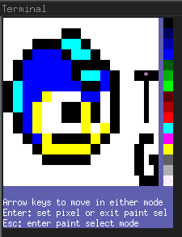

Term-Grid UI for Nodejs
=======================

Simple 2D color character grid abstraction for terminal apps.


npm package
-----------

<https://www.npmjs.com/package/term-grid-ui>

    npm install --save term-grid-ui


Usage
-----

```typescript
import { colors, keyCodes, makeTermGrid } from 'term-grid-ui'

const tg = makeTermGrid(10, 40)
tg.clear()
tg.set(2, 5, ':', colors.black, colors.white)
tg.draw()
tg.onInput(data => {
  switch (data) {
    case keyCodes.enter:
      tg.text(1, 1, 'Hello world!', colors.green, colors.black)
      break
    case 'q':
      tg.reset()
      process.exit()
  }
  tg.draw()
})
```


API Documentation
-----------------

<https://lj-ditrapani.github.io/term-grid-node/index.html>


Example
-------

To see an example cd to example/paint:

    npm install
    npm start

and read source in paint.ts for example usage.




Develop
-------

### Format, lint, build, test ###

    npm run all


### Visual test ###

    npm run visual-test


### Generate documentation ###

    npm run doc


### Publish ###

    npm login
    npm version patch/minor/major
    npm publish
